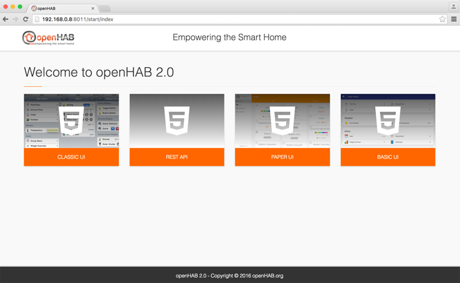



<!-- Note to authors: If you revise this article, please consider adapting the Markdown style -->

# Installation on Mac OS X

Please follow these step to get openHAB up and running. You have the choice to use the current stable version or the latest snapshot build.

* Download the openHAB distribution as the platform independent `zip` archive, provided at:
  * Current stable build (recommended): [Download `openhab-2.x.x.zip` here](https://bintray.com/openhab/mvn/openhab-distro/_latestVersion)
  * Latest snapshot/nightly build: [Download `openhab-2.x.x-SNAPSHOT.zip` here](https://openhab.ci.cloudbees.com/job/openHAB-Distribution).
* Open the terminal window.
* Choose a folder name to host your install. The directory will be created in your home folder. Be aware that the path to this folder, and the name of the folder itself, __must not contain any space character__ in order to prevent this classical cause of crash. The name chosen here is `openHAB`.
* Use the `ls` command in order to check that your directory does not exists yet.

```
cal:~ callas$ ls
Desktop			Movies
Documents		Music
Downloads		Pictures
Library			Public
```

* Move the downloaded file. Assuming that you have downloaded the file in your download folder, the command will be:

```
cal:~ admin$ mv Downloads/openhab-2 openhab
```

* Use the "ls" command in order to check that your directory exists now.

```
cal:~ callas$ ls
Desktop			Movies	Public
Documents		Music
Downloads		openhab
Library			Pictures
```

* Move inside the `openhab` folder using the "cd" command.

```
cal:~ callas$ cd openhab/
```

* Use the "ls" command in order to check what is inside.

```
cal:openhab admin$ ls
LICENSE.TXT	conf		start.bat	start_debug.bat	userdata
addons		runtime		start.sh	start_debug.sh
```


Launching openHAB for the first time
====================================

We are going to launch openHAB for the first time, in order to check that our install is successful.

* In the terminal window, type ./start.sh

* Messages are displayed, wait until the "openhab>" prompt appears.

```
cal:openhab admin$ ./start.sh
Launching the openHAB runtime...

                          __  _____    ____      
  ____  ____  ___  ____  / / / /   |  / __ )     
 / __ \/ __ \/ _ \/ __ \/ /_/ / /| | / __  | 
/ /_/ / /_/ /  __/ / / / __  / ___ |/ /_/ /      
\____/ .___/\___/_/ /_/_/ /_/_/  |_/_____/     
    /_/                        2.0.0 ...


Hit '<tab>' for a list of available commands
and '[cmd] --help' for help on a specific command.
Hit '<ctrl-d>' or type 'system:shutdown' or 'logout' to shutdown openHAB.

openhab>
```

* Without closing the terminal, open your favorite web browser and type the following url : http://localhost:8080, you should see the openHAB welcome screen.




> **Which browser should I use?**
>
> Safari is supported by openHAB but Google Chrome is recommended (due to the fact it's used by the openHAB developer community and by the owner of the ZWave plugin)
